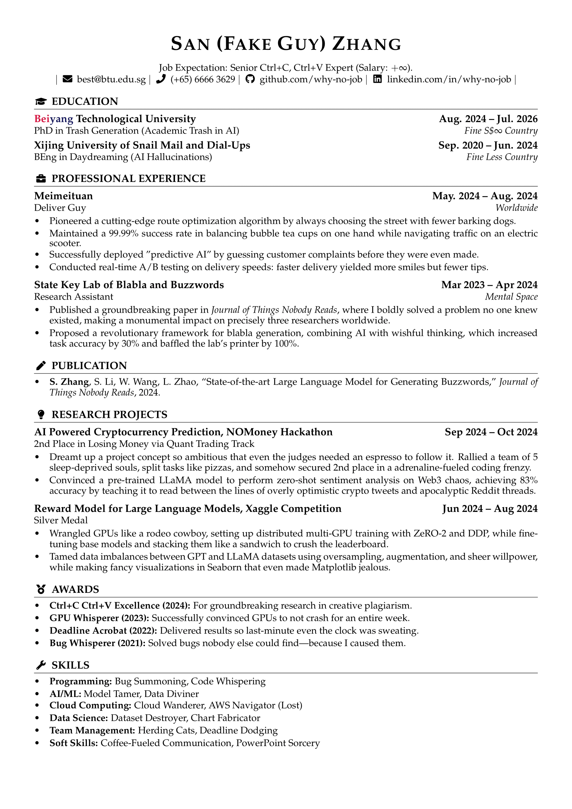

# resumeTeX

_Clean and simple LaTeX resume template for ATS system._

## About

ResumeTeX is a LaTeX resume template designed for ATS (application tracking system). It is clean and simple, with a focus on readability and ATS compatibility.

The template is designed to be easy to use and customize. It includes a number of components that can be easily added or removed.

***DO NOT LIE ON YOUR RESUME. The invisible text for ATS is only for the purpose of mitigating the impact of ATS screening on your resume. All information, both visible and invisible, shall be TRUE.***

## Features

- ATS-friendly
  - [x] Invisible text for ATS systems
- Components
  - [x] Name
  - [x] Contact
  - [x] Section
  - [x] Tagline
    - [x] One-line tagline
    - [x] Dual-line tagline
  - [x] Bullet points
- UI
  - [x] Resume friendly font families
    - [x] Serif
      - [x] Palatino style
      - [x] Times style (Times New Roman alike)
    - [ ] Sans-serif (yet to be tested, you may try)
  - [x] Industrual standard font sizes
  - [x] FontAwesome icons
  - [x] Colored text
    - [x] NTU Color Preset
- Multi-language support
  - [x] English
  - [ ] Chinese (ctex and XeLaTeX required, not implemented yet)

## License

Copyright 2024 itdevwu.

This project is licensed under the Apache License 2.0 - see the [LICENSE](LICENSE) file for details.
